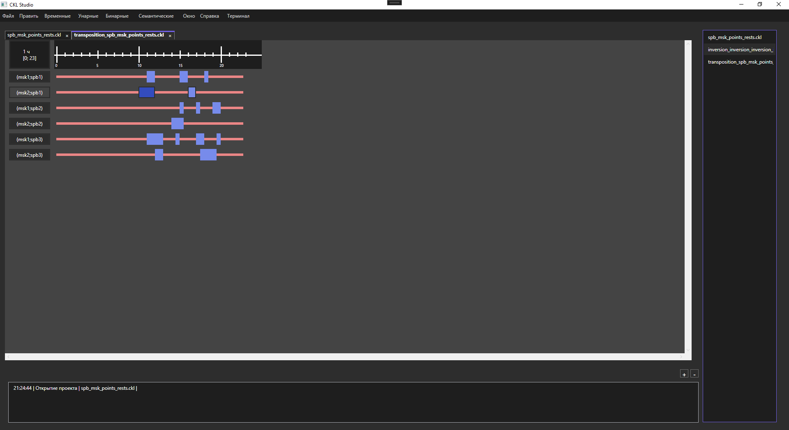

# CKL Studio: Инструментальная система для построения алгебры динамических отношений

[](https://opensource.org/licenses/MIT)
[](https://dotnet.microsoft.com/)
[](https://docs.microsoft.com/ru-ru/dotnet/desktop/wpf/)
[](https://github.com/Yvunglord/CKL_Studio/stargazers)
[](https://github.com/Yvunglord/CKL_Studio/commits/main)



## 📝 Описание проекта
CKL Studio — это прототип инструментальной системы для работы с **алгеброй динамических отношений** (циклограммами). Проект предназначен для:
- Моделирования временных зависимостей во множестве сфер, таких как производстве, логистике и управлении проектами
- Визуализации сложных динамических систем
- Анализа и оптимизации процессов

## 🌟 Основные функции
| Функция                     | Описание                                                                 |
|-----------------------------|--------------------------------------------------------------------------|
| **Редактор отношений**      | Создание и модификация динамических отношений через интуитивный интерфейс |
| **Визуализация**            | Автоматическое построение диаграмм циклограмм                           |
| **Операции над отношениями**| Поддержка унарных (`¬`, `¯`) и бинарных (`∩`, `∪`, `∘`) операций        |
| **Гибкий интерфейс**        | Режимы работы: FILE, Edit, Unary, Binary, Window                        |
| **История действий**        | Полная поддержка Undo/Redo системы                                      |

## 🛠 Технологии
- **Ядро**: C# 12, .NET 8.0
- **Интерфейс**: WPF, XAML, MVVM
- **Дополнительно**:
  - `Dependency Injection` для гибкости архитектуры
  - `CKLLib и CKLDrawing` для работы с динамическими отношениями
  - GitHub Actions для CI 

## 🚀 Установка и запуск
### Требования
- [.NET 8.0 SDK](https://dotnet.microsoft.com/download)
- IDE (рекомендуется):
  - Visual Studio 2022
  - Rider

### Запуск из исходников
```bash
git clone https://github.com/Yvunglord/CKL_Studio.git
cd CKL_Studio
dotnet build
dotnet run --project CKL.Studio